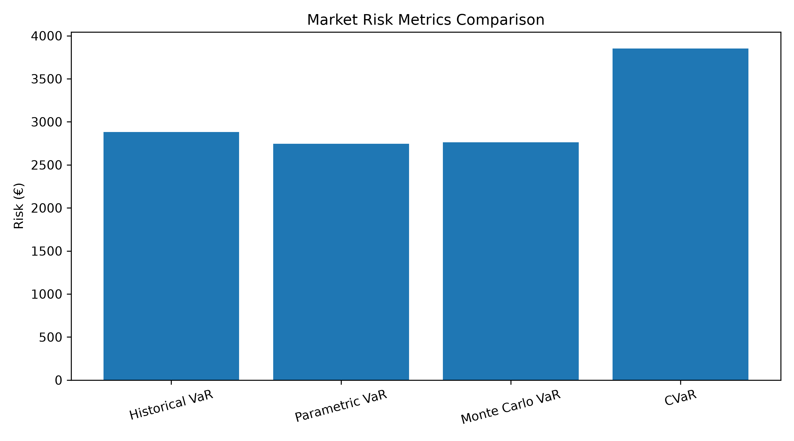
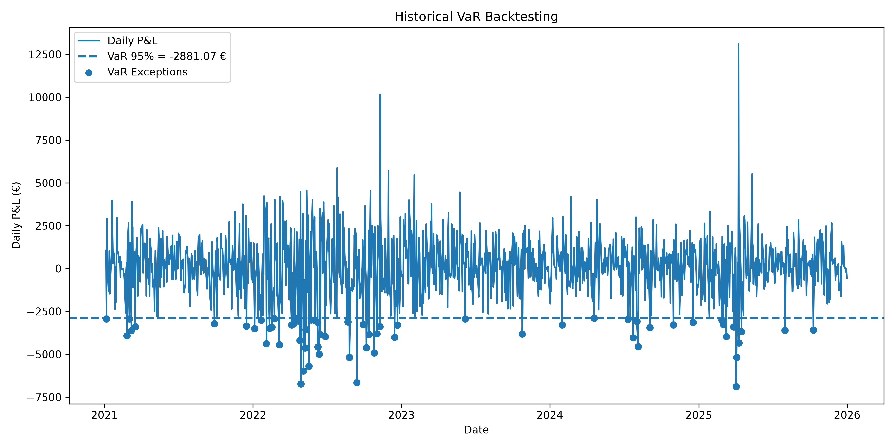

# Market Risk Analysis - Value at Risk (VaR)

This project estimates the one-day market risk of a multi-asset equity portfolio using several Value at Risk methodologies.

## Objective

The goal is to estimate the maximum potential daily loss of a portfolio at a 95% confidence level.

The project compares three VaR approaches:

- Historical VaR
- Parametric VaR
- Monte Carlo VaR

It also includes:

- Conditional Value at Risk (CVaR / Expected Shortfall)
- Historical backtesting
- Kupiec test for VaR validation

## Portfolio

The portfolio contains five US equities:

| Asset | Ticker | Weight |
|---|---|---:|
| Apple | AAPL | 25% |
| Microsoft | MSFT | 25% |
| Amazon | AMZN | 20% |
| Nvidia | NVDA | 15% |
| Alphabet | GOOGL | 15% |

Portfolio value: **€100,000**

Confidence level: **95%**

Analysis period: **2021-01-01 to 2026-01-01**

## Results

| Metric | Result |
|---|---:|
| Historical VaR 95% | €2,881.08 |
| Parametric VaR 95% | €2,746.39 |
| Monte Carlo VaR 95% | €2,763.76 |
| Historical CVaR 95% | €3,850.46 |
| Backtesting exception rate | 5.02% |
| Kupiec p-value | 0.9690 |

## Visualizations

### Risk Metrics Comparison



### Historical VaR Backtesting



## Interpretation

The historical VaR of approximately €2,881 means that, based on historical portfolio returns, the daily loss is expected to remain below approximately €2,881 in 95% of cases.

The CVaR of approximately €3,850 measures the average loss observed in the worst 5% of cases.

The backtesting exception rate is 5.02%, which is very close to the theoretical 5% expected for a 95% VaR.

The Kupiec test produces a p-value of 0.9690, meaning that the observed number of VaR exceptions is statistically consistent with the expected exception rate.

## Technologies

- Python
- Pandas
- NumPy
- SciPy
- Matplotlib
- yfinance
- Jupyter Notebook

## Project Structure

```text
market-risk-var/
├── data/
├── images/
├── notebooks/
│   └── var_analysis.ipynb
├── src/
│   └── var_portfolio.py
├── README.md
└── requirements.txt


## Skills Demonstrated

- Financial data analysis with Python
- Portfolio return calculation
- Historical, Parametric and Monte Carlo VaR
- Expected Shortfall / CVaR
- Backtesting and model validation
- Statistical testing with the Kupiec test
- Data visualization with Matplotlib
- Clean project structuring and reproducible Python environment
